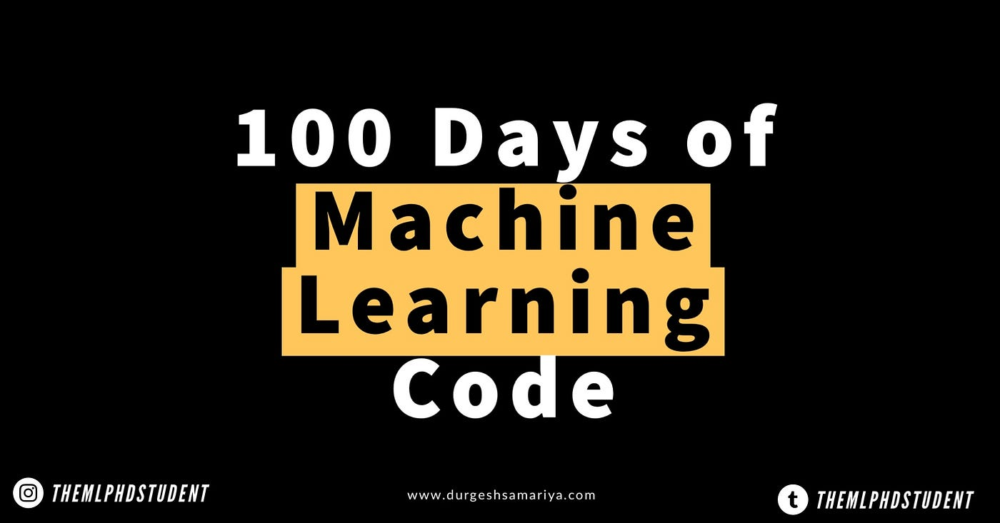

## 100 Days Of Machine Learning

### ML Project(Toy Dataset) 
- [End-To-End Toy ML Project](https://github.com/Sami606713/100_Days_Of_Machine_Learning/tree/main/End_To_End%20Toy%20ML%20Project(Day-13))
- [Web App Code](https://github.com/Sami606713/100_Days_Of_Machine_Learning/blob/main/End_To_End%20Toy%20ML%20Project(Day-13)/app.py)

### Data Gathering 
- [Getting Data From CSV Files](https://github.com/Sami606713/100_Days_Of_Machine_Learning/tree/main/DataGathering/Working%20With(csv))
- [Getting Data From Database and JSON](https://github.com/Sami606713/100_Days_Of_Machine_Learning/tree/main/DataGathering/working_with_json)
- [Getting Data From API](https://github.com/Sami606713/100_Days_Of_Machine_Learning/tree/main/DataGathering/Fetching_Data(API))
  
### Understanding Your Data 
- [Understanding Your Data using EDA(univariate Bi-Variate and Multi-Variate Analysis)](https://github.com/Sami606713/100_Days_Of_Machine_Learning/tree/main/Understanding%20Data)

### Feature Engnering 
- [Standard Scaling)](https://github.com/Sami606713/100_Days_Of_Machine_Learning/tree/main/Feature%20Engnering/FeatureTransformation/Standization)
- [Custom Scaler Class)](https://github.com/Sami606713/100_Days_Of_Machine_Learning/blob/main/Feature%20Engnering/FeatureTransformation/Standization/Custom_Standization.ipynb)
- [Normilization(MinMaxScaling)](https://github.com/Sami606713/100_Days_Of_Machine_Learning/tree/main/Feature%20Engnering/FeatureTransformation/Normilization)
- [Custom MinMaxScaler)](https://github.com/Sami606713/100_Days_Of_Machine_Learning/blob/main/Feature%20Engnering/FeatureTransformation/Normilization/Min_Max_Scaling.ipynb)
- [Roboust Scaling)](https://github.com/Sami606713/100_Days_Of_Machine_Learning/blob/main/Feature%20Engnering/FeatureTransformation/Normilization/Roboust%20Scaling.ipynb)

### Encoding Categorical Data
- [Ordinal Encoder)](https://github.com/Sami606713/100_Days_Of_Machine_Learning/blob/main/Encoding-Categorical-Data/Ordinal-Encoder.ipynb)
- [One Hot Encoder)](https://github.com/Sami606713/100_Days_Of_Machine_Learning/blob/main/Encoding-Categorical-Data/One-Hot-Encoder.ipynb)

### Transformations
- [Column Transformer)](https://github.com/Sami606713/100_Days_Of_Machine_Learning/tree/main/ColumnTransformer)

### ML-Pipeline Project
- [End-To-End-Project using Pipeline and without pipeline)](https://github.com/Sami606713/100_Days_Of_Machine_Learning/tree/main/ML-Pipelines)
- [Web App)](https://github.com/Sami606713/100_Days_Of_Machine_Learning/blob/main/ML-Pipelines/app.py)
  
### Function Transformation
- [Function Transformation](https://github.com/Sami606713/100_Days_Of_Machine_Learning/tree/main/Function-Transformer)

### Handling Missing Values
- [Handling Missing Data](https://github.com/Sami606713/100_Days_Of_Machine_Learning/tree/main/Handling-Missing-Values)

### Handling Outliers
- [z-Score Method](https://github.com/Sami606713/100_Days_Of_Machine_Learning/tree/main/Handling-Outlier/Z-Score-Method)
- [IQR Method](https://github.com/Sami606713/100_Days_Of_Machine_Learning/tree/main/Handling-Outlier/IQR-Method)
- [Winserization Method](https://github.com/Sami606713/100_Days_Of_Machine_Learning/tree/main/Handling-Outlier/Percentile-Winserization)

### Handling Imbalance Data
- [UnderSamoling](https://github.com/Sami606713/100_Days_Of_Machine_Learning/tree/main/Handling-Imbalance-Dataset/UnderSampling)
  
  
### Feature Construction
- [Feature Construction](https://github.com/Sami606713/100_Days_Of_Machine_Learning/tree/main/Feature-Construction)

  
### Feature Extraction
- [Principal Component Analysis (PCA)](https://github.com/Sami606713/100_Days_Of_Machine_Learning/tree/main/Feature%20Engnering/FeatureExtraction/PrincipalComponentAnalysis(PCA))

### Classification Matricss
- [Accuracy and confusion matrics)](https://github.com/Sami606713/100_Days_Of_Machine_Learning/tree/main/Matrics/classification_matrics)
